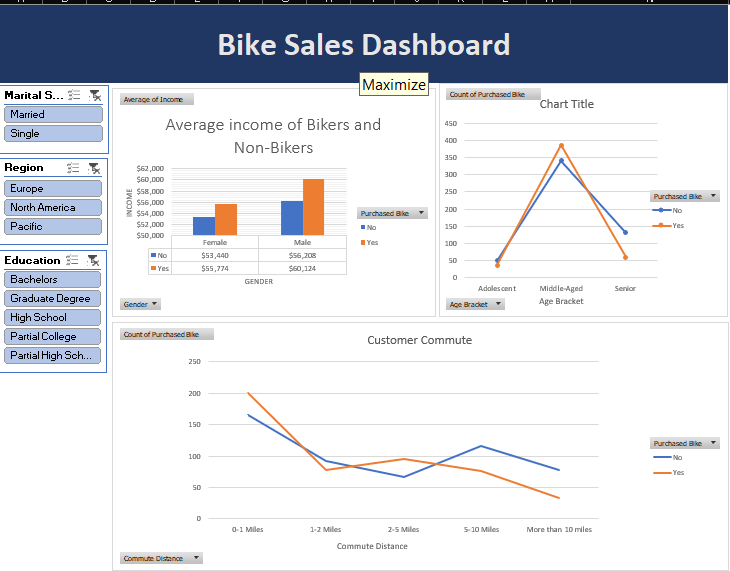
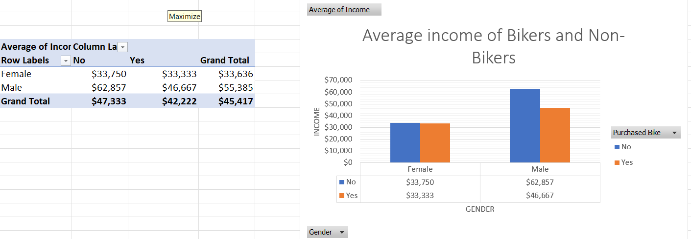
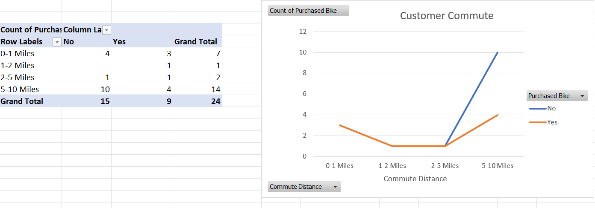
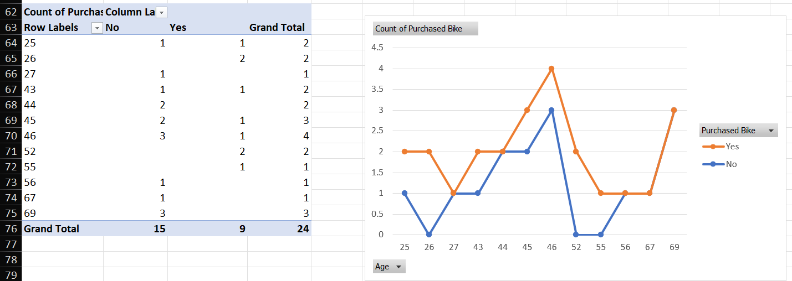
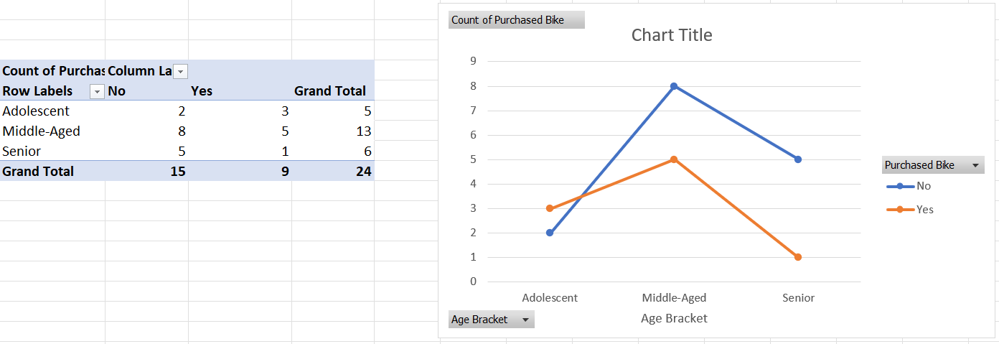

# Excel Bike Sales Dashboard

## Project Overview

This guided Microsoft Excel project was completed to strengthen my practical skills in data cleaning, analysis, visualization, and dashboard development.

The project uses a customer bike-sales dataset containing approximately 1,000 records. The data includes customer characteristics such as age, gender, income, education, marital status, region, commute distance, and bike purchase status.

My goal was to prepare the dataset for analysis, explore customer purchasing patterns using PivotTables and PivotCharts, and create an interactive dashboard that makes the results easier to understand.

---

## Dashboard Preview



The final dashboard combines several customer analyses and includes slicers that allow users to interactively filter the results by:

- Marital Status
- Region
- Education

This helped me practice presenting analytical results in a simple and accessible format.

---

## Tools and Excel Features Used

- Microsoft Excel
- Data cleaning and standardization
- Excel formulas
- Filtering and sorting
- Calculated columns
- PivotTables
- PivotCharts
- Slicers
- Dashboard development
- Data visualization

---

## Project Workflow

### 1. Data Preparation

I began by reviewing and organizing the customer data before performing the analysis.

This included:

- Checking records for consistency
- Standardizing categorical values
- Organizing and formatting the working dataset
- Using formulas and calculated columns where needed
- Preparing the data for PivotTable analysis

This stage helped reinforce the importance of preparing reliable and consistent data before building reports and visualizations.

---

### 2. PivotTable Analysis

After preparing the data, I used PivotTables to summarize the dataset and explore bike-purchasing behaviour from several perspectives.

The main areas I analyzed included:

- Average income by gender and bike purchase status
- Bike purchases by commute distance
- Bike purchases by individual customer age
- Bike purchases by age bracket

---

## Average Income by Gender



This analysis compares the average income of male and female customers based on whether they purchased a bike.

Using a PivotTable allowed me to summarize income information and compare purchasing groups more clearly.

---

## Bike Purchases by Commute Distance



This analysis compares bike-purchasing behaviour across different commute-distance categories.

It helped me explore whether commute distance appeared to be associated with differences in bike purchasing within the dataset.

---

## Bike Purchases by Age



This PivotChart compares bike purchases across individual customer ages.

Working with individual ages helped me see why grouping continuous values into broader categories can sometimes make patterns easier to interpret.

---

## Bike Purchases by Age Bracket



I grouped customers into broader age categories to make purchasing patterns easier to compare.

This provided a more summarized view of purchasing behaviour than analyzing each individual age separately.

---

## Dashboard Development

After completing the PivotTable analysis, I selected the most useful visualizations and organized them into an interactive Excel dashboard.

The dashboard uses:

- PivotCharts
- PivotTables
- Slicers
- Customer segment comparisons
- Interactive filtering

Building the dashboard helped me practice not only analyzing data, but also thinking about how analytical results should be presented to someone reviewing the information.

---

## What I Learned

This project strengthened my understanding of the Excel data-analysis workflow from data preparation through visualization.

Some of the main skills I practiced were:

- Cleaning and organizing data before analysis
- Checking data for consistency
- Using PivotTables to summarize information
- Creating PivotCharts from summarized data
- Comparing different customer segments
- Creating calculated columns
- Using slicers for interactive filtering
- Designing a simple analytical dashboard
- Communicating findings visually

One of my main takeaways from this project was that a useful dashboard depends on the quality and organization of the underlying data. Visualizations are most useful when the data has first been reviewed and prepared carefully.

---

## Repository Structure

```text
Bike-Sales-Dashboard/
│
├── README.md
├── Excel_Project_Bikes_Sales.xlsx
│
└── Screenshots/
    ├── average_income_by_gender.png
    ├── bike_purchases_by_age.png
    ├── bike_purchases_by_age_brackets.png
    ├── bike_purchases_by_commute_distance.png
    └── bike_sales_dashboard.png

```
## Credits

This project was completed as a guided learning project based on an Excel dashboard tutorial by **Alex the Analyst**.

Credit to Alex the Analyst for the original dataset and project guidance. I completed the workbook, analysis, dashboard, screenshots, and repository documentation as part of my own learning and portfolio development.
