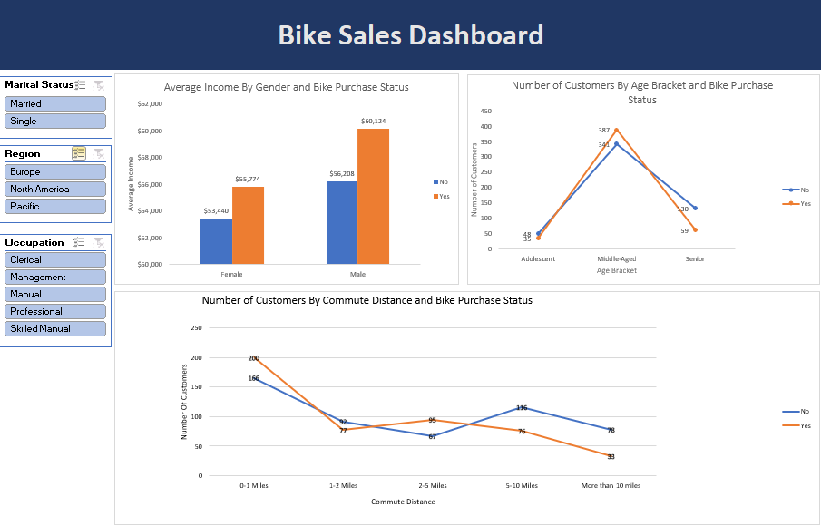

# Excel Bike Sales Dashboard

## Overview

This project explores customer demographic and lifestyle characteristics associated with bike purchases.

Using Microsoft Excel, I cleaned and prepared approximately 1,000 customer records, created PivotTables and PivotCharts, and built an interactive dashboard that allows users to explore bike-purchasing patterns across different customer segments.

## Dashboard

The dashboard can be filtered interactively using:

- Marital Status
- Region
- Occupation

The slicers update the connected PivotCharts, allowing the analysis to be explored across different customer groups.

## Business Questions

The dashboard was designed to explore questions such as:

1. How does average income differ between customers who purchased and did not purchase a bike?
2. How does bike purchase status vary across age brackets?
3. How does bike purchase status vary across commute distances?
4. How do these patterns change when customers are segmented by marital status, region, and occupation?

## Dashboard Analysis

### Average Income by Gender and Bike Purchase Status
Compares the average income of male and female customers based on whether they purchased a bike.

This helps explore whether income may be associated with differences in bike-purchasing behaviour.

### Bike Purchase Status by Age Bracket
Compares customers who purchased and did not purchase bikes across different age groups.

This helps identify age segments with higher or lower levels of bike-purchasing activity.

### Bike Purchase Status by Commute Distance
Compares bike purchase activity across customer commute-distance categories.

This allows commute distance to be evaluated as a possible factor associated with bike purchasing.

## Key Insights

- Bike-purchasing behaviour varies across customer age groups, suggesting that age is a useful dimension for customer segmentation.
- Commute distance shows noticeable differences in bike-purchase activity, making it another useful factor when analyzing potential customer groups.
- Average income differs between bike purchasers and non-purchasers across demographic groups, suggesting income may provide useful context when combined with other customer characteristics.
- Interactive filtering by occupation, region, and marital status shows that purchasing patterns can change significantly between customer segments.

These observations describe patterns within this dataset and do not establish that any individual characteristic directly causes a customer to purchase a bike.

## Excel Skills Demonstrated

- Data cleaning and standardization
- Excel formulas and calculated fields
- Filtering and formatting
- PivotTables
- PivotCharts
- Slicers
- Interactive dashboard development
- Data visualization
- Customer segmentation
- Data interpretation

## Dataset

The dataset contains approximately 1,000 customer records and includes fields such as:

- Customer ID
- Marital Status
- Gender
- Income
- Children
- Education
- Occupation
- Home Ownership
- Number of Cars
- Commute Distance
- Region
- Age
- Age Bracket
- Purchased Bike

## Project Workflow

1. Reviewed the raw customer data for inconsistencies.
2. Cleaned and standardized fields for analysis.
3. Created calculated fields where required.
4. Built PivotTables to summarize customer characteristics and bike-purchase behaviour.
5. Created PivotCharts from the summarized data.
6. Added slicers for Marital Status, Region, and Occupation.
7. Connected the slicers to the dashboard reports for interactive filtering.
8. Organized the final charts into an interactive Excel dashboard.
9. Reviewed the results and documented key observations.

## Files

- `Excel_Project_Bikes_Sales.xlsx` — Excel workbook containing the dataset, analysis, PivotTables, and dashboard.
- `Screenshots/bike_sales_dashboard.png` — Final dashboard screenshot.

## Project Note

This project was completed as a guided Excel project based on an Alex The Analyst data analytics portfolio tutorial.

I completed the data cleaning, PivotTable analysis, PivotChart creation, dashboard construction, interactive filtering, and project documentation as part of my Excel learning and portfolio development.
