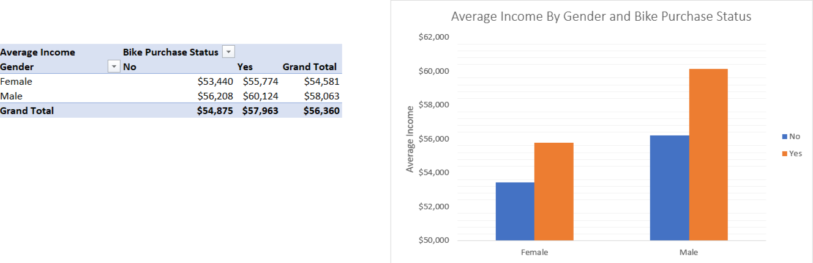
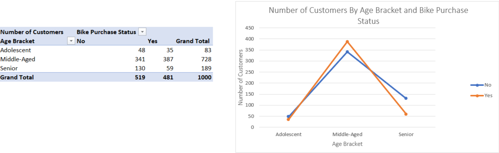
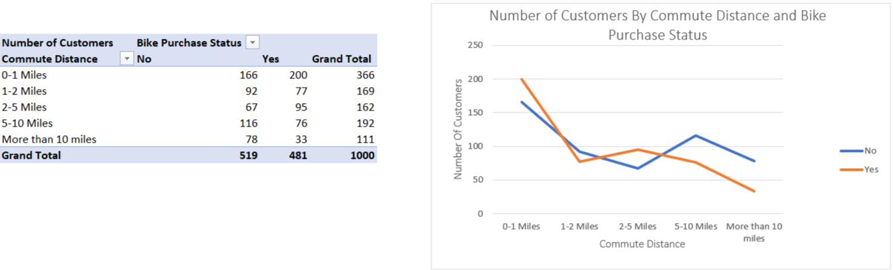

# Excel Bike Sales Dashboard

## Overview

This project analyzes customer demographic and lifestyle characteristics associated with bike purchases using Microsoft Excel.

I worked with approximately 1,000 customer records and developed an Excel workflow that moves from raw data through data cleaning and preparation, PivotTable analysis, PivotChart reporting, and an interactive dashboard.

The final dashboard allows users to compare bike purchasers and non-purchasers across income, age, and commute-distance characteristics while interactively filtering the analysis by customer segment.

## Dashboard


The dashboard contains three main analyses:

- Average Income by Gender and Bike Purchase Status
- Number of Customers by Age Bracket and Bike Purchase Status
- Number of Customers by Commute Distance and Bike Purchase Status

Data labels are included in the dashboard to make the values easier to interpret directly from the visualizations.

### Interactive Filters

The dashboard can be filtered using slicers for:

- Marital Status
- Region
- Occupation

The slicers are connected to the PivotCharts, allowing the same analysis to be explored across different customer segments.

## Business Questions

The project was designed to explore the following questions:

1. How does average income differ by gender and bike purchase status?
2. How does the number of customers who purchased or did not purchase a bike vary across age brackets?
3. How does the number of customers who purchased or did not purchase a bike vary across commute-distance categories?
4. How do these patterns change when customers are filtered by marital status, region, and occupation?

## Data Preparation

The original customer data is preserved in a separate raw-data worksheet within the Excel workbook.

A separate working sheet was created for cleaning and preparing the data used in the analysis.

The preparation process included:

- Reviewing the raw customer records for inconsistencies
- Standardizing categorical values into more readable formats
- Formatting fields for analysis
- Preserving the original raw data separately from the cleaned working data
- Creating an Age Bracket field from customer age for grouped analysis

This approach keeps the original dataset available while providing a cleaned version for PivotTable and dashboard analysis.

## Analysis

### Average Income by Gender and Bike Purchase Status



This report compares the average income of male and female customers while separating customers according to whether they purchased a bike.

The PivotTable provides the summarized values behind the PivotChart, making it possible to compare the average income of purchasers and non-purchasers directly.

### Number of Customers by Age Bracket and Bike Purchase Status



This report compares the number of customers who purchased and did not purchase a bike across different age brackets.

The analysis helps identify differences in bike-purchasing activity among customer age groups.

### Number of Customers by Commute Distance and Bike Purchase Status



This report compares the number of customers who purchased and did not purchase a bike across different commute-distance categories.

The analysis helps examine whether bike-purchasing patterns differ between customers with shorter and longer commute distances.

## Key Insights

- Middle-Aged customers represent the largest customer group in the dataset and also contain the highest number of bike purchasers among the age brackets analyzed.
- Customers with a commute distance of 0–1 miles show the highest number of bike purchases among the commute-distance categories.
- The longest commute-distance categories show fewer bike purchases than the shortest commute-distance category in this dataset.
- For both male and female customers, the average income of bike purchasers is higher than the average income of non-purchasers.
- Interactive filtering by marital status, region, and occupation allows these overall patterns to be explored across more specific customer segments.

These observations describe patterns within this dataset and do not establish that income, age, commute distance, or another individual characteristic directly causes a customer to purchase a bike.

## Excel Skills Demonstrated

- Data cleaning and standardization
- Data preparation
- Excel formulas and calculated fields
- Filtering and formatting
- PivotTables
- PivotCharts
- Slicers
- PivotChart connections
- Interactive dashboard development
- Data visualization
- Customer segmentation
- Data interpretation
- Analytical documentation

## Dataset

The dataset contains approximately 1,000 customer records.

The original data includes fields such as:

- Customer ID
- Marital Status
- Gender
- Income
- Children
- Education
- Occupation
- Home Ownership
- Number of Cars
- Commute Distance
- Region
- Age
- Purchased Bike

An Age Bracket field was created during data preparation to group customers into age categories for analysis.

## Project Workflow

1. Preserved the original customer data in a separate raw-data worksheet.
2. Created a working sheet for data cleaning and preparation.
3. Reviewed the raw records for inconsistencies.
4. Cleaned and standardized categorical values.
5. Formatted fields and created the Age Bracket field.
6. Built PivotTables to summarize customer characteristics and bike purchase status.
7. Created PivotCharts from the summarized PivotTable data.
8. Added slicers for Marital Status, Region, and Occupation.
9. Connected the slicers to the dashboard PivotCharts.
10. Organized the visualizations into the final Bike Sales Dashboard.
11. Added data labels to improve interpretation of dashboard values.
12. Reviewed the results and documented key observations.

## Workbook Structure

The Excel workbook contains four main worksheets:

- `bike_buyers_raw` — original customer data
- `Working Sheet` — cleaned and prepared data used for analysis
- `Pivot Table` — PivotTables and supporting PivotCharts
- `Dashboard` — final interactive dashboard

## Repository Structure

```text
Bike-Sales-Dashboard/
│
├── Excel_File/
│   └── Bike_Sales_Analysis.xlsx
│
├── Screenshots/
│   ├── Dashboard/
│   │   └── bike_sales_dashboard.png
│   │
│   └── Reports/
│       ├── average_income_by_gender_and_bike_purchase_status.png
│       ├── number_of_customers_by_age_bracket.png
│       └── number_of_customers_by_commute_distance.png
│
└── README.md
```
## Credits

This project was completed as a guided Excel project based on a tutorial by Alex The Analyst.

The original dataset and project framework were provided through the tutorial. I completed the Excel workflow as part of my learning, including data cleaning and standardization, PivotTable analysis, PivotChart creation, interactive dashboard development, and project documentation.

I also refined the presentation of the project by organizing the workbook into raw data, working data, supporting reports, and a final dashboard, and documented the analysis and observations in this repository.

Credit to Alex The Analyst for the original tutorial and project guidance.
